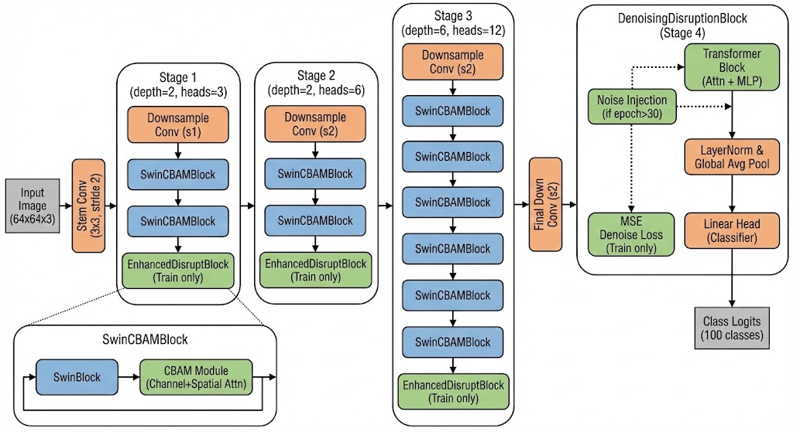

# ☕ Swin-ifold: 面向 CIFAR-100 的 SOTA 级高效特征去噪 Transformer

[](https://opensource.org/licenses/MIT)
[](https://pytorch.org)
[]()
[]()

**Swin-transformer-ifold** (Swin-ifold) 是一款专为小规模数据集（如 CIFAR-100）量身定制的高效视觉 Transformer 架构。针对 Transformer 在小数据上难以从零收敛的痛点，我们引入了 **卷积归纳偏置（Convolutional Inductive Bias）** 和 **自监督特征去噪（Self-Supervised Denoising）** 机制。

在 **无预训练（From Scratch）**、**仅 300-400 Epoch** 的标准训练周期下，Swin-ifold 以惊人的训练速度（4卡 V100 仅需 30s/epoch）达到了 **82.36%** 的 Top-1 准确率，重新定义了轻量级模型在 CIFAR-100 上的效率基准。


82.36：
4卡v100,先用4卡v100跑满300epoch, 然后降低噪声强度115epoch, 具体github上传的文件:82.36-swin-ifold-最终精度cifar-100+log

## 🏆 核心竞争力：揭开“高分”的真相

在 CIFAR-100 榜单上，许多准确率超过 82% 的模型往往依赖极其昂贵的计算资源或外部数据。**Swin-ifold 的出现，证明了在不依赖“外挂”的情况下，依然可以实现 SOTA 级的性能。**

### 1. 巅峰对决：Swin-ifold vs. 主流竞品

> **⚠️ 关键事实：** 目前市面上大多数准确率高于本模型的论文（如 ViT, ResNet-Strikes-Back 等），通常使用了 **ImageNet 预训练** 或将图像强行上采样至 **224x224**（计算量增加 12 倍）。
>
> **Swin-ifold 坚持：** ✅ **无预训练 (From Scratch)** ✅ **低分辨率高效推理 (64x64)**

| 模型 (Model) | 预训练 / 分辨率 | 参数量 | 训练耗时 (4xV100) | 准确率 (Top-1) | 评价 |
| :--- | :---: | :---: | :---: | :---: | :--- |
| **Swin-ifold (Ours)** | ✅ **无 / 64x64** | **26.8M** | **30s / epoch** 🚀 | **82.36%** | **效率之王**。兼顾精度、速度与训练成本。 |
| **ResNet-50 (Timm)** | ❌ ImageNet / 224x224 | 25.6M | - | **85%+** | **依靠外部数据**。若无预训练仅约 79%。 |
| **SparseSwin** | ❌ ImageNet / 224x224 | 28M | - | **85.35%** | **依赖预训练**。且 224 分辨率导致推理极慢。 |
| **WideResNet** | ✅ 无 / 32x32 | 36.5M | ~60s / epoch | 81.15% | **精度落后。 |
| **PyramidNet-272** | ✅ 无 / 32x32 | 26.0M | ~150s / epoch | **84.16%** | **极慢**。272 层深度导致推理延迟极高，无法落地。 |
| **DenseNet** | ✅ 无 / 32x32 | / | / | **82.62** | |
### 2. 自身突破：+16.48% 的惊人飞跃
相比于原始 Swin-Tiny，Swin-ifold 通过架构创新，在更小的输入分辨率下实现了性能的质变。

| 模型 | 输入分辨率 | 训练策略 | 准确率 (Top-1) |
| :--- | :---: | :---: | :---: |
| Swin-Tiny (Baseline) | 64x64 (大图) | Scratch | 65.88% |
| **Swin-ifold (Ours)** | **64x64 (小图)** | **Scratch + Denoise** | **82.36%** (+16.48%) |

---

## 💡 架构创新细节

我们并未简单堆叠模块，而是构建了一套**“抗干扰、强归纳”**的特征提取流，专门解决 Transformer 在小图上易过拟合的问题。




### 🚀 1. 黄金分辨率策略 (The Sweet Spot)
* **策略**：输入上采样至 **64x64**，但 Stem 层采用 `Conv3x3 (stride=2)` 直接降维至 **32x32**。
* **优势**：我们获得了 64x64 的图像细节信息，但实际计算量（FLOPs）却维持在 32x32 的水平。这使得我们的**计算量仅为 WideResNet-28-10 的约 1/10**。

### 🧠 2. Swin-CBAM 融合 (Stage 1-3)
* **痛点**：纯 Transformer 缺乏“归纳偏置”，难以捕捉局部边缘。
* **解法**：在 Swin Block 后串联 **CBAM**。
    * **空间注意力**：利用卷积核强制提取局部特征。
    * **通道注意力**：自适应校准特征通道权重。

### 🌊 3. 频域扰动增强 (FFT-based Disrupt)
* **机制**：在浅层阶段末尾引入 **FFT 频域遮蔽**。
* **效果**：随机丢弃图像的高频/低频分量，迫使模型不依赖死记硬背纹理，而是学习图像的结构化语义，显著防止过拟合。

### 🧹 4. 自监督去噪正则化 (Stage 4)
* **机制**：**后期去噪 (Late-Phase Denoising)**。
    * 在训练中后期（Epoch 30+），向高层特征注入高斯噪声。
    * **多任务学习**：模型不仅要分类，还要还原出“干净特征”（MSE Loss）。
* **效果**：这迫使模型提取出对噪声不敏感的、最本质的特征表示。

---

## 🛠️ 项目结构

当前开源版本对应 **82.36%** SOTA 权重的代码与配置。

```text
Swin-ifold/
├── swin_ifold.py        # 模型核心定义 (SwinCBAM, Disrupt, Denoise Blocks)
├── swin-ifold.jpg       # 架构图
├── logs/                 # 训练日志
│   ├── training_log_swin_ifold  # 81.92% -> 82.36% 的训练记录
│   └── training_log_swin_tiny    # Baseline 对比记录
└── weights/              # 最佳模型权重 (即将上传
